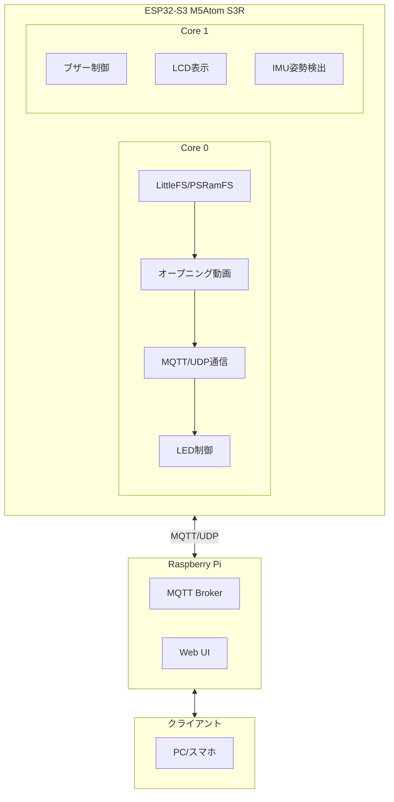

# 🌐 MFT2025 Isolation Sphere

ESP32-S3（M5Atom S3R）をベースにした球体ディスプレイ制御システム。  
センサーで球体の姿勢を検出し、テクスチャの描画座標を補正することで、**ボールを転がしても画像の天地が保たれる球体ディスプレイ**を実現します。

## ✨ 主な機能

- 🎥 **オープニング動画再生** - 起動時にLittleFSからJPEG連番動画を自動再生
- 🎵 **起動音再生** - M5Unifiedのブザー機能による起動サウンド
- 💡 **800球LEDディスプレイ** - 4本のWS2812ストリップによる球体表示
- 🎯 **姿勢制御** - IMUセンサーによる姿勢検出とテクスチャ補正
- 🌐 **MQTT/UDP通信** - Raspberry Piとの連携による外部制御
- 📱 **Web UI** - ブラウザからの設定・制御インターフェース
- 🔄 **OTA更新** - 無線でのファームウェア更新

## 🏗️ システム構成



## 🛠️ 技術スタック

### ハードウェア

- **メインボード**: M5Stack Atom S3R (ESP32-S3)
- **ディスプレイ**: 内蔵LCD + 800球WS2812 LEDストリップ×4
- **センサー**: BNO055 IMUセンサー
- **ストレージ**: LittleFS (3MB) + PSRam (3MB)

### ソフトウェア

- **フレームワーク**: PlatformIO + Arduino
- **主要ライブラリ**:
  - `M5Unified` - M5Stack統合ライブラリ
  - `FastLED` - LED制御（I2S DMA対応）
  - `LovyanGFX` / `M5GFX` - グラフィック描画
  - `AsyncMqttClient` - MQTT通信
  - `TJpg_Decoder` - JPEG画像デコード
  - `ESP32-PSRamFS` - PSRamファイルシステム

## 🚀 セットアップ

### 1. 開発環境準備

```bash
# PlatformIO CLIのインストール
pip install platformio

# プロジェクトのクローン
git clone https://github.com/sastles-com/MFT2025.git
cd MFT2025
```

### 2. 依存関係のインストール

```bash
# ライブラリの自動インストール
pio lib install
```

### 3. ビルドと書き込み

```bash
# ビルド
pio run -e atoms3r

# ファームウェア書き込み
pio run -t upload -e atoms3r

# ファイルシステム（アセット）書き込み
pio run -t uploadfs -e atoms3r

# シリアルモニター
pio device monitor -b 115200
```

## 📁 プロジェクト構造

```text
├── src/
│   └── main.cpp              # メインプログラム
├── include/                  # ヘッダーファイル
├── lib/                      # プロジェクト専用ライブラリ
├── test/                     # ユニットテスト
├── spiffs_dir/              # LittleFSアセット
│   ├── config.json          # システム設定
│   ├── led_layout.csv       # LED座標定義
│   └── images/              # 画像アセット
│       ├── opening/         # オープニング動画
│       ├── demo01/          # デモ動画1
│       ├── demo02/          # デモ動画2
│       └── demo03/          # デモ動画3
├── platformio.ini           # PlatformIO設定
├── partitions.csv           # ESP32パーティション定義
├── isolation_sphere_spec.md # 技術仕様書
├── isolation_sphere_tasks.md # 実装タスク一覧
├── mqtt_rules.md            # MQTT通信仕様
└── AGENTS.md               # 開発ガイドライン
```

## ⚙️ 設定

### config.json

```json
{
  "wifi": {
    "ssid": "your_wifi_ssid",
    "password": "your_wifi_password"
  },
  "mqtt": {
    "broker": "192.168.1.100",
    "port": 1883,
    "client_id": "isolation_sphere_01"
  },
  "display": {
    "brightness": 128,
    "rotation": 0
  },
  "led": {
    "strips": [180, 220, 180, 220],
    "pins": [5, 6, 7, 8],
    "max_fps": 30
  }
}
```

> **補足**: LittleFS に書き込むファイル（例: `config.json`, ジョイスティック設定など）は `data/` ディレクトリにまとめて配置します。反映する際は `pio run -t buildfs -e atoms3r_bmi270` → `pio run -t uploadfs -e atoms3r_bmi270` を実行して、`data/` の内容を ESP32 と同期させてください。

### LED配置 (led_layout.csv)

```csv
strip_id,index,x,y,z
0,0,-0.866,0.500,0.000
0,1,-0.866,0.485,0.129
...
```

## 🎮 MQTT制御インターフェース

### 基本トピック構造

```text
sphere/
├── control/          # 制御コマンド
├── status/           # ステータス情報
├── media/            # メディア制御
└── config/           # 設定変更
```

### 制御例

```bash
# 動画再生
mosquitto_pub -t "sphere/media/play" -m '{"video": "demo01"}'

# LED輝度調整
mosquitto_pub -t "sphere/control/brightness" -m '{"value": 200}'

# 姿勢リセット
mosquitto_pub -t "sphere/control/reset_orientation" -m '{}'
```

## 🧪 テスト

### ユニットテスト実行

```bash
# 全テスト実行
pio test -e atoms3r

# 特定テスト実行
pio test -e atoms3r -f test_config
```

## 🔄 OTAアップデート

### ファームウェア（`/update`）

1. `config.json` の `ota.enabled` を `true` にし、SSID/パスワードを設定してデバイスを再起動。
2. シリアルモニタに `OTA Service started. http://<IP>/ (user:admin)` が表示されたら、PC/スマホを同じネットワークに接続。
3. ブラウザで `http://<IP>/update` へアクセスし、Basic認証（デフォルト: `admin` / `sphere`）を通過。
4. `pio run -e atoms3r_bmi270` 等で生成される `firmware.bin` を指定してアップロード。完了後に自動で再起動します。

### LittleFSアセット（`/uploadfs`）

1. PC側で LittleFS イメージを生成:
   ```bash
   pio run -t buildfs -e atoms3r_bmi270
   ```
   生成物は `.pio/build/atoms3r_bmi270/littlefs.bin` に出力されます。
2. ブラウザで `http://<IP>/uploadfs` にアクセス（同じBasic認証が適用されます）。
3. 表示されるフォームから `littlefs.bin` を選択してアップロード。成功メッセージが表示されたら数秒後に再起動します。

> ⚠️ **注意**: `/uploadfs` はバイナリ1ファイルのみ受け付けます。フォルダや複数ファイルを直接アップロードすることはできません。アセットを更新する際は必ず `buildfs` で新しい LittleFS イメージ（`.bin`）を生成してください。

### デバッグ

```bash
# デバッグビルド
pio run -e atoms3r --build-type debug

# 例外デコーダー付きモニター
pio device monitor -b 115200 --filter esp32_exception_decoder
```

## 🔧 開発ガイドライン

### TDD（テスト駆動開発）

1. 期待される入出力に基づき、まずテストを作成
2. テストを実行し、失敗を確認
3. テストが正しいことを確認後、コミット
4. テストをパスさせる実装を進める

### クラスベース設計

- config, buzzer, LCD, IMUなどをクラス化
- ユニットテストはクラス単位で検証
- プログラム本体はクラスを組み合わせて実装

### コミット規約

```bash
# 機能追加
git commit -m "feat: add imu sensor integration"

# バグ修正
git commit -m "fix: correct led coordinate mapping"

# ドキュメント更新
git commit -m "docs: update api documentation"
```

## 📊 パフォーマンス目標

- **LED更新頻度**: 30fps以上
- **起動時間**: 5秒以内
- **MQTT応答時間**: 100ms以内
- **メモリ使用量**: PSRam 3MB以内

## 🤝 コントリビューション

1. このリポジトリをフォーク
2. 機能ブランチを作成 (`git checkout -b feature/amazing-feature`)
3. 変更をコミット (`git commit -m 'feat: add amazing feature'`)
4. ブランチにプッシュ (`git push origin feature/amazing-feature`)
5. プルリクエストを作成

## 📄 ライセンス

このプロジェクトは MIT ライセンスの下で公開されています。詳細は [LICENSE](LICENSE) ファイルを参照してください。

## 🔗 関連リンク

- [技術仕様書](isolation_sphere_spec.md)
- [実装タスク一覧](isolation_sphere_tasks.md)
- [MQTT通信仕様](mqtt_rules.md)
- [開発ガイドライン](AGENTS.md)
- [PlatformIO Documentation](https://docs.platformio.org/)
- [M5Stack Atom S3R](https://docs.m5stack.com/en/core/AtomS3R)

## 📞 サポート

質問や問題がある場合は、GitHubのIssuesページでお気軽にお問い合わせください。

---

**MFT2025 Isolation Sphere Project** - *Making the impossible visible* 🌟
