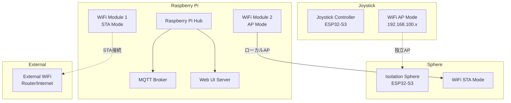

# MFT2025 Project - WiFi Architecture Overview

## プロジェクト概要

MFT2025プロジェクトは、Isolation Sphere球体ディスプレイシステムを中心とした分散制御システムです。以下の3つの主要コンポーネントで構成されています：

1. **Isolation Sphere** - 球体ディスプレイ本体（ESP32-S3）
2. **Joystick Controller** - コントローラー（ESP32-S3 M5Atom S3R）
3. **Raspberry Pi** - 中央制御・WiFiハブ

## WiFiアーキテクチャ

### 全体構成



### 各デバイスのWiFi役割

#### 1. Joystick Controller（このプロジェクト）

- **モード**: APモード固定
- **SSID**: `isolation-joystick` (デフォルト)
- **IP範囲**: `192.168.100.x`
- **用途**:
  - 独立したローカルネットワークを提供
  - MQTTブローカー内蔵
  - 直接制御用UI提供
- **接続**: STAモードでの外部WiFi接続は**行わない**

#### 2. Isolation Sphere

- **モード**: STAモード
- **接続先**: Raspberry PiのローカルAP
- **用途**: Raspberry Pi経由でのコマンド受信・状態送信

#### 3. Raspberry Pi（WiFiハブ）

- **WiFiモジュール1**: STAモード
  - 外部WiFiルーター/インターネットに接続
  - リモート制御・監視用
- **WiFiモジュール2**: APモード
  - ローカルネットワーク `192.168.4.x` 提供
  - Isolation Sphereが接続
- **機能**:
  - MQTTブローカー
  - Web UI Server
  - データログ・解析
  - 外部API連携

## ネットワーク分離設計の理由

### 1. 独立性の確保

- Joystickは独立したAPとして動作
- 外部ネットワーク障害時でも直接制御可能
- リアルタイム制御要求に対する低遅延保証

### 2. セキュリティ

- 制御系とインターネット系の物理分離
- 各ネットワークセグメントでの独立したアクセス制御

### 3. スケーラビリティ

- 複数のSphereを同一Raspberry Piで管理可能
- Joystickの追加時は独立APとして展開

## 通信プロトコル

### MQTT Topic構造

```text
sphere/
├── ui/              # UI制御関連
├── system/          # システム状態
├── display/         # 表示制御
└── sensor/          # センサーデータ
```

### UDP通信（Joystick ↔ Sphere直接）

- リアルタイム制御データ
- 遅延最小化が必要な操作

## 設定ファイル構造

各デバイスは `config.json` で統一的に設定管理：

```json
{
  "system": {
    "name": "device-name",
    "debug": true
  },
  "wifi": {
    "enabled": true,
    "mode": "ap",  // joystick: "ap", sphere: "sta"
    "ap": {
      "ssid": "isolation-joystick",
      "password": "",
      "localIp": "192.168.100.1",
      "channel": 6,
      "maxConnections": 8
    }
  },
  "mqtt": {
    "enabled": true,
    "broker": "192.168.100.1",
    "port": 1883
  }
}
```

## 開発・テスト環境

### ローカル開発

1. Joystick APに開発PCを接続
2. `192.168.100.1` でMQTTブローカー・UI利用
3. 実機テスト・デバッグ

### 統合テスト

1. Raspberry Pi環境でのフル構成テスト
2. 複数デバイス同時接続テスト
3. 外部ネットワーク連携テスト

## トラブルシューティング

### WiFi接続問題

- Joystick: APモード起動確認 (`WiFi.softAPIP()`)
- Sphere: STA接続先確認・DHCP状態
- Raspberry Pi: 両WiFiモジュール状態確認

### 通信問題

- MQTTブローカー稼働状況
- ファイアウォール・ポート設定
- ネットワーク分離設定の確認

---

## 関連ドキュメント

- [MQTT Rules](./mqtt_rules.md) - MQTTトピック設計規約
- [UI Rules](./ui_rules.md) - UI実装ガイドライン
- [Config Definition](./define_config.md) - 設定ファイル仕様
- 各プロジェクトの `README.md` および仕様書
